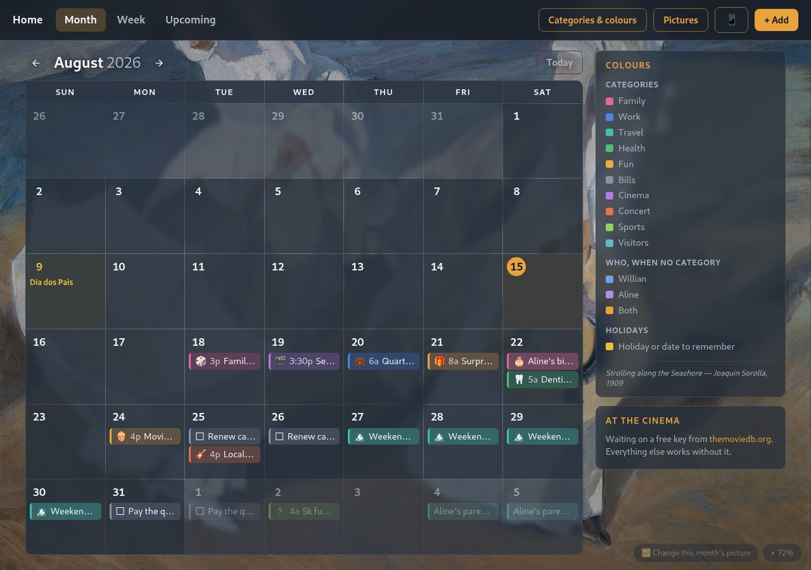
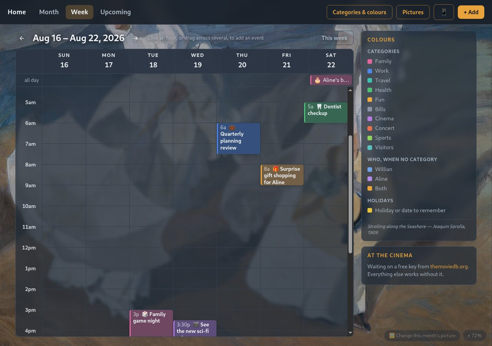
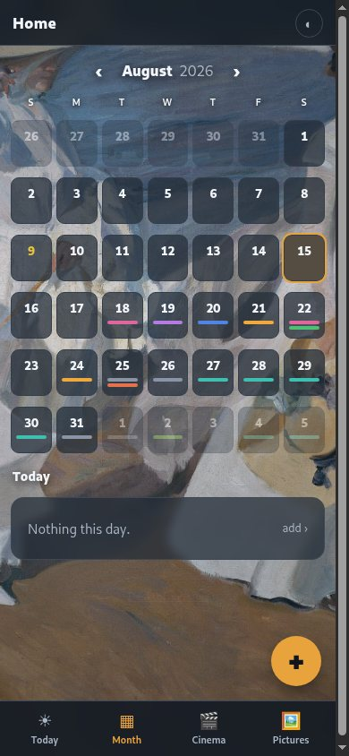

# Family calendar

A shared household calendar built around the failure that motivated it: a
flight and a concert booked for the same evening, discovered too late to fix.
Month, week and upcoming views, categories with colours, US and Brazilian
holidays computed rather than looked up, a picture behind the calendar that
changes with the month, and an overlap warning that offers "save anyway"
rather than blocking, because some double-bookings are deliberate.

FastAPI, Postgres and Jinja templates. No ORM, no build step, no JavaScript
framework. It installs as a PWA on a phone, has a purpose-built phone UI
alongside the desktop one, and can nag a household over Telegram until a
to-do is actually done.



<p>
  
  
</p>

*Left: the week grid, where dragging across hours creates an event. Right: the
phone UI, which is a separate set of templates rather than the desktop layout
squeezed down.*

## Try it

```sh
cp .env.example .env      # only CAL_DB_PASSWORD needs a value
make demo                 # builds, starts, and loads a demo month
```

Then open <http://127.0.0.1:3002>. The demo data in `demo/seed.sql` is
invented: a plausible month of family events across every category, a
recurring birthday, a couple of standalone reminders, one private event, and
one event in each category the app can feed to another app's "attended"
diary. `make demo-reset` puts it back.

Without the demo step you get an empty calendar and the default categories,
which is also a perfectly good place to start.

## Running for real

This is not a portfolio demo that was built and abandoned. It runs continuously
on a small home server, in Docker, and two people use it every day. The access
model is the part most worth copying:

- **Nothing is port-forwarded.** The home router has no inbound ports open, so
  there is no public attack surface pointing at the house.
- **The household reaches it from anywhere in the world** over a Tailscale
  tailnet: a phone on mobile data in another country gets the same app as a
  laptop on the sofa. `tailscale serve` terminates TLS with a real certificate,
  so it is proper HTTPS without exposing anything to the internet.
- **Exactly one path is public**, a Tailscale Funnel address, and it exists for
  one device that cannot join the tailnet (a work laptop with a managed
  profile). That path is the only one that ever sees the login in
  `app/gate.py`, and the session cookie is shared with the household's other
  apps, so one login covers all of them. Everything arriving from the private
  network is trusted and is never asked to authenticate, which is the whole
  design: put the authentication where the trust boundary actually is, not
  everywhere.
- **Backups run nightly and an uptime probe hits `/health` every couple of
  minutes.** Both live in a separate private infrastructure repo, because this
  repo is the app and nothing else.

## What is interesting in here

**Two UIs, one app.** There is a full desktop template set and a separate,
purpose-built phone template set (`app/templates/phone/`), chosen per device
by a "Mobi" token in the user agent, overridable by a cookie in either
direction. They are not a shared layout with a media query bolted on: bottom
tabs instead of a nav bar, a floating add button, a today-first home screen.
Same routes, same view functions, same database query, two render targets —
`render()` in `app/main.py` is the one place that decides which template set
answers. The standing rule that came with the decision: a feature that ships
on only one of them is not done.

**Yearly repetition is a boolean, not a rule engine.** Birthdays and
anniversaries get one flag, `repeats_yearly`. The stored date is the first
occurrence; every view projects it onto the years it needs at render time
(`project_yearly` in `app/main.py`), which is why a birthday stored decades
ago never needs updating and a birthday query never has to reach for
anything resembling an RRULE parser. February 29th lands on the 28th in a
non-leap year rather than raising, because a birthday that crashes the
calendar one year in four is not a feature, and clicking a projected
occurrence edits the one stored row, which is the only sensible meaning of
"editing a birthday."

**The reminder lead time, and why an all-day event is different.** A timed
appointment gets two Telegram reminders: the evening before at a fixed local
hour, and two hours ahead of the actual time. An all-day event gets only the
first, because "two hours before" means nothing for something with no hour.
Standalone reminders (to-dos with a due date and no time at all,
`item_kind='reminder'`) are a third shape entirely: they nag once a day at a
fixed morning hour, starting immediately or after a configurable lead time,
and they keep nagging *past* the due date until a checkbox is pressed —
missing a deadline is exactly the moment a nag must not go quiet.

**Per-person artwork, resolved as a chain.** The picture behind the calendar
resolves in three steps (`app/art.py`): a person's own upload, if their
device is recognised and they have one; the shared upload, if anybody set one
for that month; a public-domain painting, one per month, if nobody has. Each
level is checked fresh on every request rather than cached at startup, so
dropping in a picture is "upload it" with no restart, and deleting a person's
own picture reveals the shared one underneath rather than an empty background
— a real bug this chain fixed, once "remove" deleted the wrong level because
nothing on screen said which one was showing.

**Private events are filtered at the source, not in the template.** An event
can be marked private to one person, and every query that lists events for
another app or another person appends the same one-line filter
(`visible_to()` in `app/main.py`) rather than trusting each caller to
remember it. The API endpoint that feeds another household app its "what did
we attend" diary excludes private rows unconditionally, because that
endpoint has no viewer to be private *from* — it is read by a service both
people already read, so a private row simply never leaves the database for
that path at all.

**The trusted-network gate.** There is no login for anyone on the household's
own private network — home Wi-Fi, or a private overlay network like
Tailscale. `app/gate.py` classifies the request's real client address (read
carefully from the right-hand end of `X-Forwarded-For`, skipping only the
proxy hops this deployment actually adds) before it ever asks who the
person is. Only a request whose real address is genuinely public gets a
login screen, sessions are an HMAC-signed cookie, and passwords are pbkdf2
hashes that live only in the host's `.env`. Unconfigured means the public
path fails *closed*: a private-network visitor never notices, a public one
is told to configure it rather than let in.

**One codebase answers on its own port and under a path prefix.** Every URL
the app emits — links, redirects, the PWA manifest — is built from
`X-Forwarded-Prefix` (`prefix()` in `app/main.py`), which is empty when the
app is reached directly and set to something like `/calendar` when a router
in front of it proxies a public host's subpath here. The router strips the
prefix before forwarding, so routes never see it; the app only has to be
disciplined about writing it back into everything it renders. That is what
lets one deployment be both a private app on a home network and a path on a
shared public host, with no second build and no second config.

## Layout

```
app/main.py           routes, schema, event/category CRUD, the private-event rule
app/art.py             month number to background picture, the person/shared/painting chain
app/gate.py            who is trusted, who needs a password
app/people.py          which device belongs to which person
app/holidays.py        US federal + Georgia, Brazil + Rio Grande do Sul, all computed
app/news.py            an optional "what's playing" rail (needs a free API key)
app/reminders.py       Telegram: reminders, the daily nag, the Done/Not yet buttons
app/ui.py               which UI a device gets (desktop or phone)
app/templates/         Jinja, server-rendered, no JS framework (desktop UI)
app/templates/phone/   the phone UI: same routes, same data, phone-shaped screens
app/static/art/        the pictures, one per month (see the README there)
demo/seed.sql           the invented month used by `make demo`
docker-compose.yml      app + postgres, loopback-bound on purpose
```

The committed compose file binds to loopback only: a reverse proxy or a
private overlay network is meant to be the way in. Host-specific extras, a
LAN address or another port, belong in a `docker-compose.override.yml`,
which is git-ignored.

Configuration is all in `.env.example`, and every variable there is optional
except the database password.

## Status

The design notes in [STATUS.md](STATUS.md) and the roadmap in
[OBJECTIVES.md](OBJECTIVES.md) are worth a look if you want the reasoning
rather than just the code: what was built, what was deliberately left out,
and which rules came from watching the app actually get used by two people.

## License

MIT, see [LICENSE](LICENSE).
